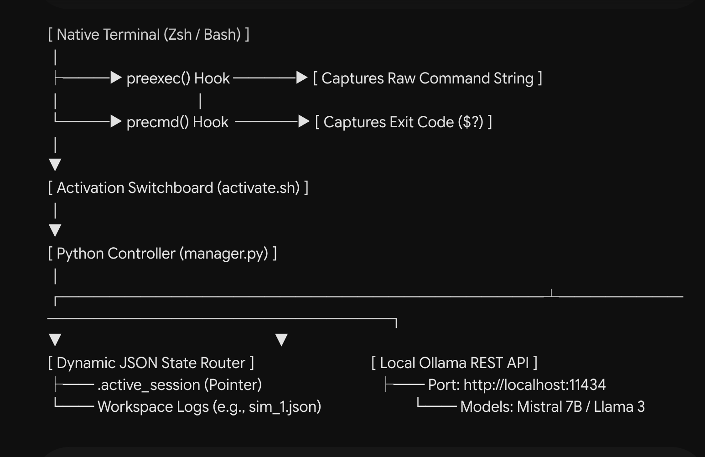

# 🧪 UoM Lab Manager V2: Autonomous Shell & Local LLM Integration Engine

[](https://www.python.org/)
[](https://www.gnu.org/software/bash/)
[-FF6F00.svg?style=for-the-badge&logo=ollama&logoColor=white)](https://ollama.com/)
[](https://www.manchester.ac.uk/)
[](#-license--attribution)

> **Solving the Computational Reproducibility Crisis:** An autonomous, non-intrusive shell interception framework that bridges native POSIX terminal environments with localized Generative AI to automate experiment tracking, parameter extraction, proactive error mitigation, and time-travel RAG analysis.

---

## 📌 Table of Contents
1. [Overview & Core Philosophy](#-overview--core-philosophy)
2. [Key Architectural Innovations](#-key-architectural-innovations)
3. [System Architecture](#-system-architecture)
4. [Installation & Setup](#-installation--setup)
5. [Interactive Usage Guide](#-interactive-usage-guide)
6. [Advanced Feature Capabilities](#-advanced-feature-capabilities)
7. [Project Structure](#-project-structure)
8. [License & Attribution](#-license--attribution)

---

## 💡 Overview & Core Philosophy

In modern computational science and machine learning research, experimentation occurs rapidly within command-line interfaces. Researchers execute hundreds of variations of numerical models, modifying hyperparameters directly via CLI flags. Traditional workflows suffer from a severe **reproducibility deficit**: shell histories are ephemeral, parameter variations are undocumented, and runtime errors require tedious manual debugging.

**UoM Lab Manager V2** transforms the standard macOS Zsh or Linux Bash terminal into an **intelligent, self-documenting laboratory**. Operating entirely offline on local hardware to ensure absolute data privacy, the engine intercepts terminal execution lifecycles to build structured JSON audit trails and provides proactive debugging assistance using local Large Language Models (e.g., Mistral 7B, Meta Llama 3) running via Ollama.

---

## ⚡ Key Architectural Innovations

* 🛡️ **Dual-Layer Non-Intrusive Interception:** Utilizes native Zsh system hooks (`preexec` and `precmd`) to capture raw command inputs and post-execution termination signals (`$?`) without wrapping or altering host operating system execution paths.
* 🗂️ **Dynamic Workspace Routing:** Features an interactive TUI (Text User Interface) upon activation, isolating distinct numerical experiments into dedicated, queryable JSON schemas managed via state pointers.
* 🔍 **Intelligent Parameter Extraction:** Automatically parses complex command-line arguments (e.g., `--batch-size 256 --lr 0.05 --dry-run`) into structured, key-value JSON metadata for high precision searchability.
* 🤖 **Proactive Autonomous Error Mitigation:** Instantly detects non-zero shell exit codes, analyzes the failing command syntax against local OS context, and streams immediate, localized remediation commands.
* 📝 **Anti-Laziness Code Modification Engine:** Integrates a specialized regex parsing pipeline and strict prompt constraints to force local LLMs to rewrite full Python scripts autonomously while stripping unwanted markdown conversational bloat.
* ⏳ **Time-Travel RAG (Retrieval-Augmented Generation):** Serializes historical JSON session metadata back into the LLM context window, enabling researchers to query their own experimental timeline using natural language.

---

## 🏗️ System Architecture

The project is structured around a decoupled **Switchboard-to-Brain** architecture:

<p align="center">
  
</p>

---

## 🚀 Installation & Setup

### Prerequisites
* **Operating System:** macOS (Zsh default) or Linux (Zsh / Bash)
* **Python:** Version 3.10 or higher
* **AI Engine:** [Ollama](https://ollama.com/) installed and running locally

### 1. Clone the Repository
```bash
git clone [https://gitlab.cs.man.ac.uk/your_username/uom-lab-manager-v2.git](https://gitlab.cs.man.ac.uk/your_username/uom-lab-manager-v2.git) ~/.lab_manager_v2
cd ~/.lab_manager_v2
```


2. Provision Local AI Models
Ensure your local Ollama instance has pulled the required target weights:

```bash
ollama pull mistral
```
# Optional: 
```bash
ollama pull llama3
```


3. Activate the Sandbox Environment
To maintain host safety, the framework operates as an isolated sandbox. Activate the workspace wrapper:

```bash
source ~/.lab_manager_v2/activate.sh
```


📖 Interactive Usage Guide
Session Initialization
Upon sourcing the activation script, the system prompts the interactive session manager:

==================================================
 🧪 UoM Lab Manager V2 - Interactive Session Menu
==================================================
Select a Workspace:
 [0] ➕ Create a NEW session here
 [1] 📁 Link an existing JSON file via custom path
 [2] 🔄 Continue: heramb.json

Enter number: 0
Enter new session name: neural_net_tuning
✅ Active session locked to: /Users/username/.lab_manager_v2/neural_net_tuning.json


Autonomous Background Logging
Once locked, execute standard shell commands or numerical scripts normally. Everything is tracked silently:

```bash
python3 main.py --batch-size 128 --epochs 5 --lr 0.01 --save-model
```

The system extracts the flags and appends a structured timestamped record into neural_net_tuning.json.


Proactive Error Debugging
If a command executes with a syntax error or missing dependency, the manager intercepts the failure:
```bash
python3 main.py --invalid-parameter-flag
```


⚠️ [Error]: 'python3 main.py --invalid-parameter-flag' failed.
🤖 Mistral is analyzing...

💡 Suggestion: The command failed because '--invalid-parameter-flag' is not a recognized argument in your argparse configuration. Remove the flag or define it inside main.py using parser.add_argument().


🔬 Advanced Feature Capabilities
1. Autonomous Script Modification (--modify)
Direct the LLM to read an existing code file, apply architectural or hyperparameter changes, and generate a clean, executable file automatically:
```bash
ai --modify main.py "Change the default batch size to 256, set epochs to 20, and add Adam optimizer"
```
Output: The engine processes the script through a regex filter to eliminate AI conversation chatter, saving a ready-to-run file named modified_main.py.


2. Time-Travel RAG Summarization (--summarize)
Query your active session history to generate audit summaries or recall forgotten hyperparameter attempts:
```bash
ai --summarize "What learning rates have I tested today, and which run achieved success?"
```
Output: The local LLM ingests the structured JSON log and synthesizes an executive summary of your experimental progression.


3. CLI Parameter Extraction (--extract)
Analyze external scripts to map out all valid CLI arguments without executing the code:
```bash
ai --extract main.py
```


Deactivating the Sandbox
When your research session concludes, cleanly detach all terminal hooks:
```bash
deactivate_lab
```
🛑 UoM Lab Manager V2 Deactivated. Terminal returning to normal.


📂 Project Structure

.lab_manager_v2/
├── activate.sh            # Zsh hook multiplexer and virtual environment switchboard
├── manager.py             # Core Python engine (JSON state router, regex parser, Ollama API bridge)
├── .active_session        # Hidden dynamic state pointer tracking active workspace paths
├── .gitignore             # Exclusion rules for local logs and dynamic pointers
├── README.md              # Project documentation and architectural overview
└── workspaces/            # Directory storing structured JSON experiment audit trails
    ├── default_session.json
    └── neural_net_tuning.json


🏛️ License & Attribution
Copyright (c) 2026 Heramb Rajesh Jaipurkar. All Rights Reserved.

This project was engineered as part of the Master of Science (MSc) in Advanced Computer Science dissertation at The University of Manchester, under the supervision of Prof. Georgios Detorakis.

This repository is made publicly available strictly for academic evaluation, peer review, and examination purposes. Unauthorized commercial exploitation, duplication, or redistribution of this software is strictly prohibited under the attached Academic License.
